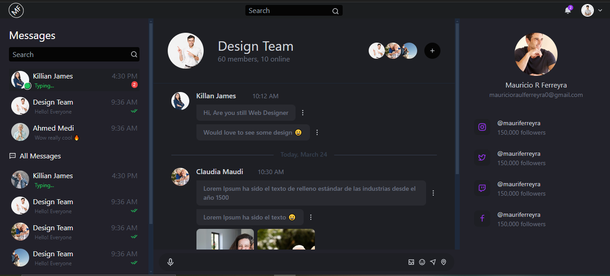
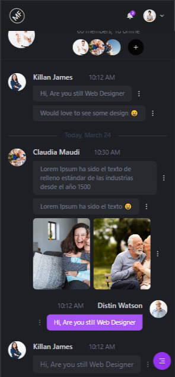
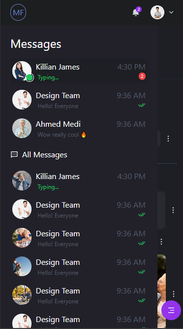

# Design UI React + Tailwind

## Descripción

Diseño de interfaz de usuario (UI) con pocas funcionalidades implementadas por el momento.

## Tecnologías Utilizadas

- **Gestor de paquetes:** Bun
- **Biblioteca:** React.js
- **Lenguaje:** JavaScript
- **Estilos:** Tailwind CSS
- **Componentes adicionales:** Tailwind Scrollbar

## Requisitos Previos

- Bun instalado (versión 1.1.29)
- Node.js (versión 20.12.2)

## Instalación

1. Clonar el repositorio

```bash
git clone https://github.com/MauricioRaulFerreyra/design-ui-chat.git
cd design-ui-chat
```

2. Instalar dependencias

```bash
bun install
```

3. Iniciar el proyecto en modo desarrollo

```bash
bun run dev
```

## Capturas de Pantalla

### Escritorio



### Mobile




## Características

- Diseño de Navegación Intuitivo: La barra de navegación superior con iconos y etiquetas claras facilita la exploración y el acceso a las principales secciones del sitio.
- Uso Efectivo del Espacio: La distribución de los elementos en la interfaz aprovecha eficientemente el espacio disponible, creando una sensación de limpieza y orden.
- Paleta de Colores Armoniosa: La combinación de tonos azules, grises y blancos transmite profesionalismo y elegancia, alineada con la identidad de marca.
- Iconografía Personalizada y Consistente: Los iconos custom diseñados para este proyecto refuerzan la identidad visual y complementan de manera coherente los elementos de la interfaz.
- Diseño Adaptable a Múltiples Dispositivos: El diseño se ve bien y es fácil de usar tanto en pantallas de escritorio como móviles, gracias a un enfoque responsive.
- Interacciones Fluidas y Agradables: Elementos como el menú desplegable y las transiciones suaves entre secciones crean una experiencia de usuario fluida y natural.
- Jerarquía Visual Clara: La disposición y el contraste de los elementos, como el tamaño y peso de la tipografía, guían eficazmente la atención del usuario a través de la interfaz.

## Contacto

- Mauricio R Ferreyra
- mauricioraulferreyra0@gmail.com
- Links a redes sociales o perfil de GitHub
